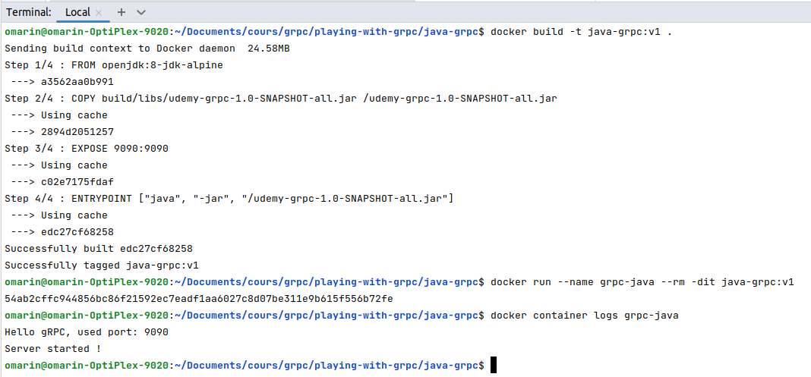

## I. <u>Serveur gRPC Java</u>

#### 1. <u>Générer les sources gRPC Java</u>

Lien: [Plugin gRPC JAVA](https://repo1.maven.org/maven2/io/grpc/protoc-gen-grpc-java/1.52.1/)

```shell
$ mv ~/Téléchargements/protoc-gen-grpc-java-1.40.1-osx-x86_64.exe /usr/local/bin/protoc-gen-grpc-java-1.40.1-linux-x86_64.exe
$ chmod +x /usr/local/bin/protoc-gen-grpc-java-1.40.1-linux-x86_64.exe
$ cd /$HOME/Documents/cours/grpc/playing-with-grpc/java-grpc/
$ sh grpc_generation.sh
```
Ou utiliser le plugin gradle

```shell
$ sh gradlew build
```

#### 2.a. <u>Lister les utilitaires fournis par Gradle</u>

```shell
$ cd java-grpc
$ sh gradlew tasks 
```
#### 2.b. <u>Compiler java-grpc avec Gradle</u>

```shell
$ cd java-grpc
$ sh gradlew build 
```

#### 2.c. <u>Lancer java-grpc depuis la console</u>

```shell
$ cd java-grpc
$ sh gradlew shadowJar
$ java -jar ./build/libs/udemy-grpc-1.0-SNAPSHOT-all.jar
```


#### 2.d. <u>Lancer le projet Gradle sous docker</u>

```shell
$ docker build -t java-grpc:v1 .
$ docker run --name grpc-java --rm -dit java-grpc:v1
$ docker container logs grpc-java
```



```shell
$ docker build -t java-grpc:v1 .
$ docker run --name grpc-java --rm -dit java-grpc:v1
$ docker container logs grpc-java
```

#### 2.e. <u>Lancer le projet Gradle sous docker en mode interactif</u>

```shell
$ docker build -t java-grpc:v1 .
$ docker run --name grpc-java --rm -it --entrypoint /bin/sh java-grpc:v1
# java -jar udemy-grpc-1.0-SNAPSHOT-all.jar
```

## II. <u>Client gRPC React</u>

#### Transpiler le projet React

```shell
$ npm install
$ npm start
$ export NODE_OPTIONS=--openssl-legacy-provider
```


#### Lancer le docker compose

```shell
$ docker-compose up
```


#### Requête pour changer le niveau du logger http d'envoy

## III. <u>Proxy Envoy</u>

```shell
$ curl -X POST http://localhost:9901/logging?http=debug
$ curl -X POST http://localhost:9901/logging?http2=debug
```

## IV. <u>Network Docker</u>

## V. <u>Docker Compose</u>